# BigDataProject
In this project I have created an end to end Big data ETL pipeline which comprised of Hadoop HDFS as storage layer, Apache Hive as Data warehouse, Apache spark as ETL engine, Apache airflow as data orchestration and presto for query analysis.

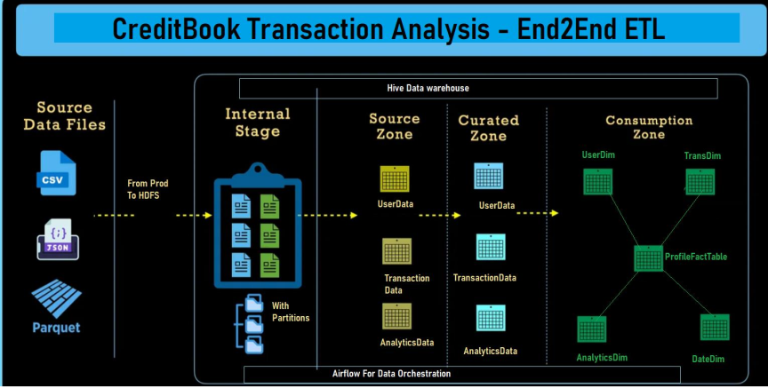

1. Introduction

This project outlines the design and implementation of an end-to-end ETL pipeline enriched with Apache Airflow integration. The pipeline is architected using Python, SQL, and various Apache tools, catering to the data processing needs of our client, with a focus on scalability, efficiency, and maintainability.

2. Infrastructure Setup
   The infrastructure comprises several key components:
   .  Storage Layer: Hadoop Distributed File System (HDFS) is utilized for efficient storage and retrieval of large volumes of data.
   .  Data Warehousing: Apache Hive is employed as the data warehousing solution, providing structured querying capabilities.
   .  ETL Engine: Apache Spark serves as the ETL engine, enabling high-speed processing of data transformations.
   .  Data Orchestration: Apache Airflow is utilized for orchestrating the data pipeline, ensuring seamless execution of tasks.
   .  Full Load & Incremental Load: Using apache spark, I created a separate mechanism for full load and incremental load.
   .  Query Monitoring: Presto is integrated for monitoring query complexity and optimizing performance.

3. Data is ingested from the client's provided URLs and stored in HDFS in Parquet format with Snappy compression. This approach ensures efficient storage and retrieval of data, with partitions created based on date and time for enhanced query performance. Apache Spark is leveraged for data ingestion, facilitating parallel processing and scalability.

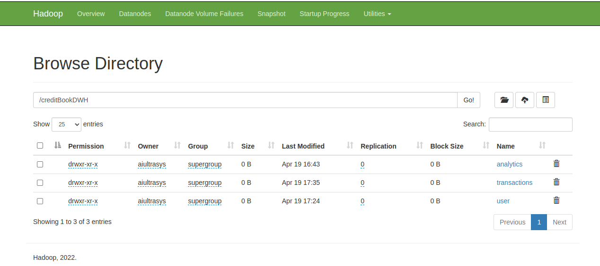
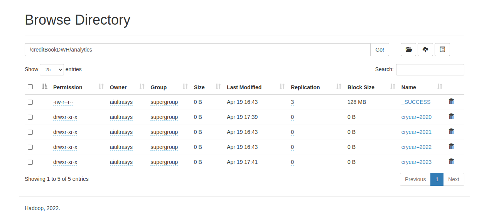
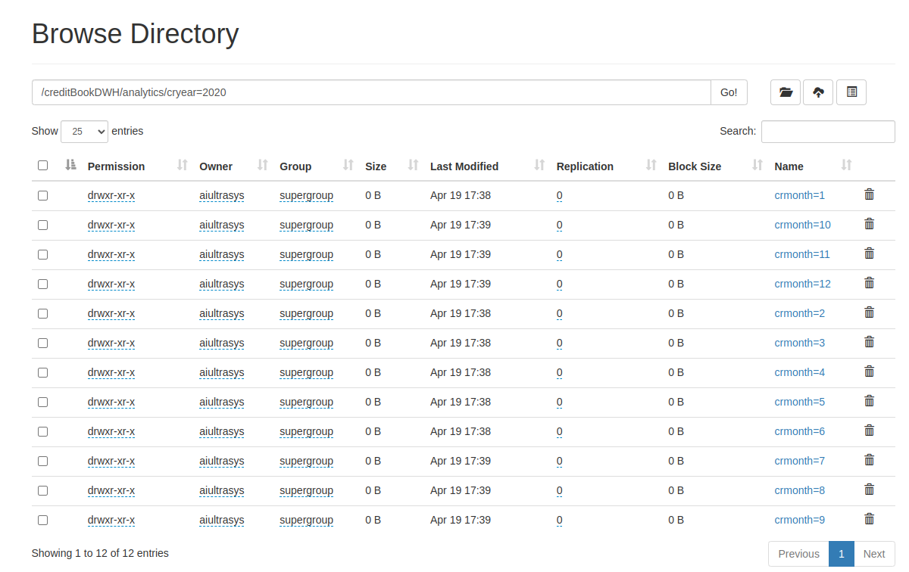
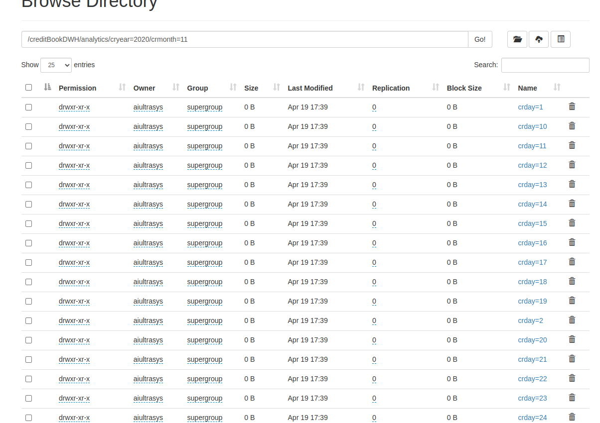

5. Layered Approach
The ETL pipeline is structured into three layers:

Source Layer:
In the Source Layer, data is loaded into an external Hive table from HDFS. This enables seamless querying of raw data using Hive or Presto CLI, providing flexibility in data
exploration.

Curated Layer: 
The Curated Layer focuses on data transformation and preparation. Various transformations such as cleaning, datatype correction, formatting, column creation, aggregation, and joins are performed to prepare the data for analysis. The transformed data is stored in an internal Hive table, ensuring curated data is readily accessible for downstream processing.

Consumption Layer:
The Consumption Layer is where the transformed data is modeled for analytics purposes. A star schema is implemented, comprising fact and dimensional tables. Surrogate keys and foreign keys are established to maintain relationships between dimension and fact tables. Aggregate data is incorporated into the fact table to facilitate efficient analytics. Separate internal Hive tables are created for each dimension and fact table, organized based on primary keys, surrogate keys, and foreign keys.

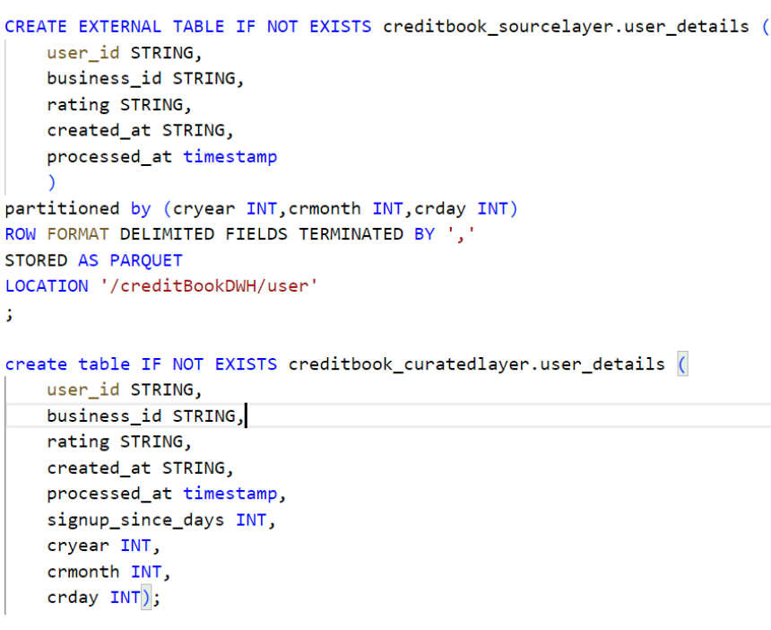
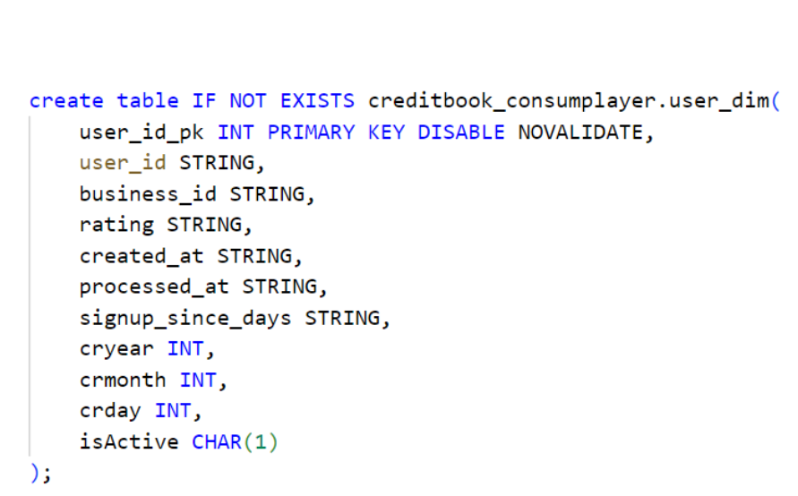

5. Data Modeling
The data modeling approach revolves around a star schema, which provides a structured and optimized data model for analytics. This schema consists of:
  .  Fact Table: Represents the core metrics of interest (e.g., transactions), containing surrogate keys and foreign keys to related dimension tables.
  .  Dimension Tables: Represent descriptive attributes (e.g., user details, date information), providing context to the facts. Each dimension table contains surrogate keys for efficient querying and joins.

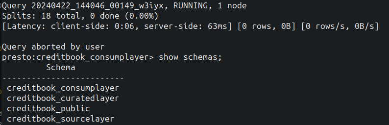
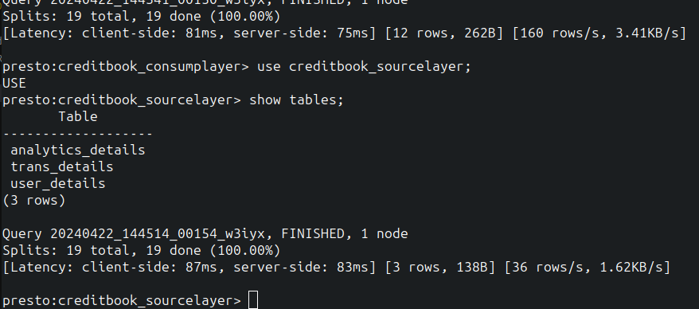
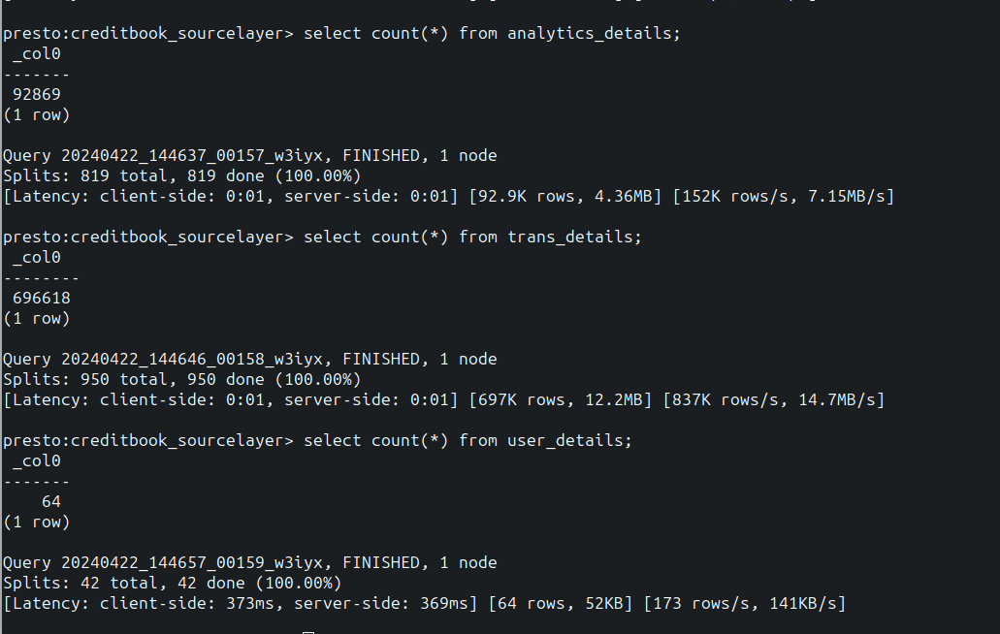
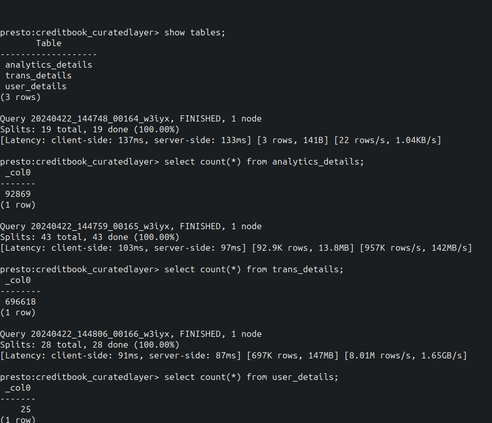

7. Apache Airflow Integration
Apache Airflow is seamlessly integrated into the pipeline to orchestrate tasks and automate workflow execution. Directed Acyclic Graphs (DAGs) are created to define the workflow, ensuring tasks are executed sequentially or in parallel based on dependencies and schedules. This integration enhances pipeline reliability, scalability, and monitoring capabilities.

8. Full Load and Incremental Load Mechanisms
Within the Spark code, a separate mechanism is implemented to handle both full load and incremental load scenarios. This mechanism allows for flexibility in data loading strategies based on the requirements:

  .  Full Load: When the ETL code is executed with the "FullLoad" parameter, the entire dataset is processed and loaded from one layer to another. This ensures that all data is transferred and refreshed, useful for periodic updates or initial data setup.
  .  Incremental Load: In contrast, when the ETL code is executed with the "IncrementalLoad" parameter, only new or updated data is processed and loaded. This mechanism identifies changes since the last load and selectively transfers the relevant data, reducing processing time and resource utilization.

By implementing both full load and incremental load mechanisms, the ETL pipeline optimizes data processing efficiency and ensures that the most up-to-date information is available for analysis without unnecessary reprocessing of unchanged data.

8. Conclusion
In conclusion, the implemented ETL pipeline fulfills the client's requirements for transforming and aggregating their production database into a usable format for the data team. The modular
design, coupled with the use of scalable technologies, ensures the pipeline's efficiency, flexibility, and maintainability.

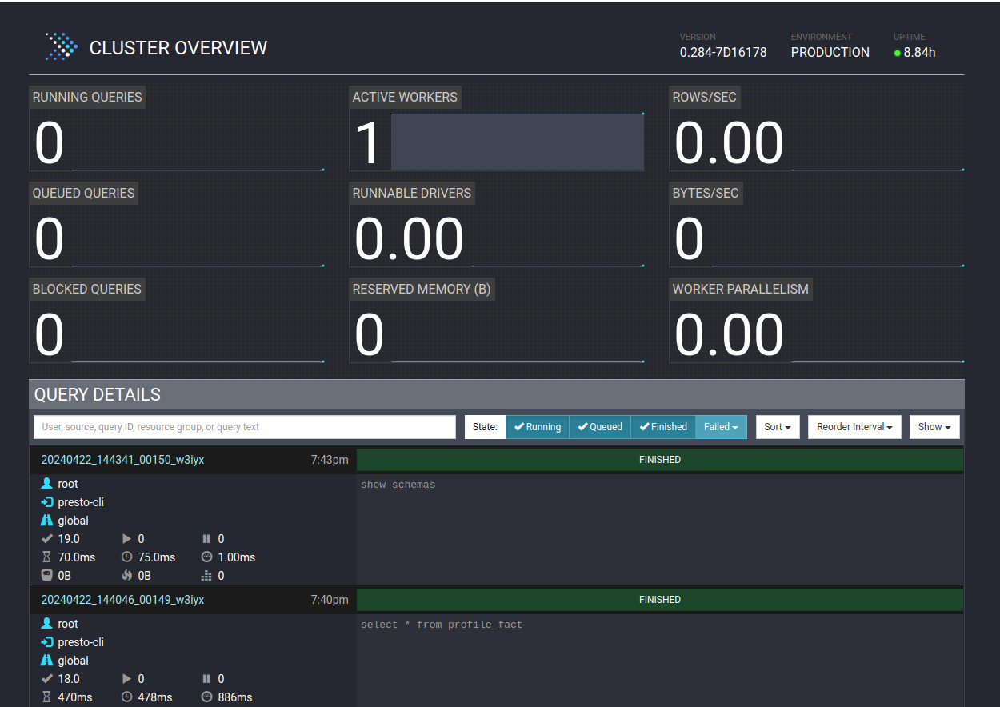

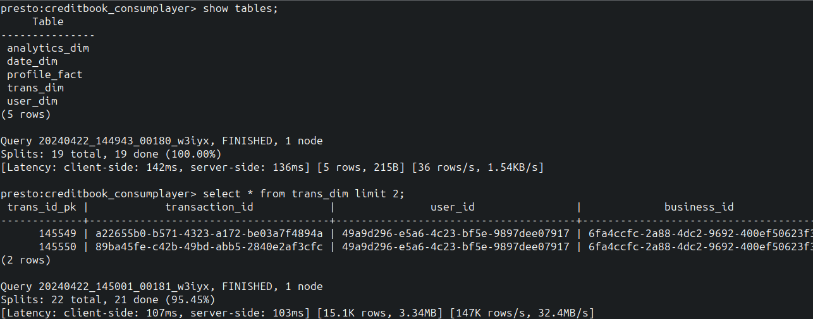

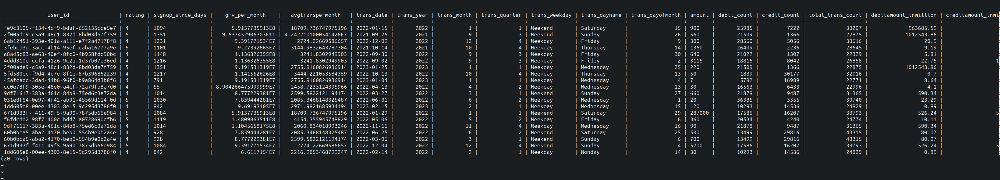

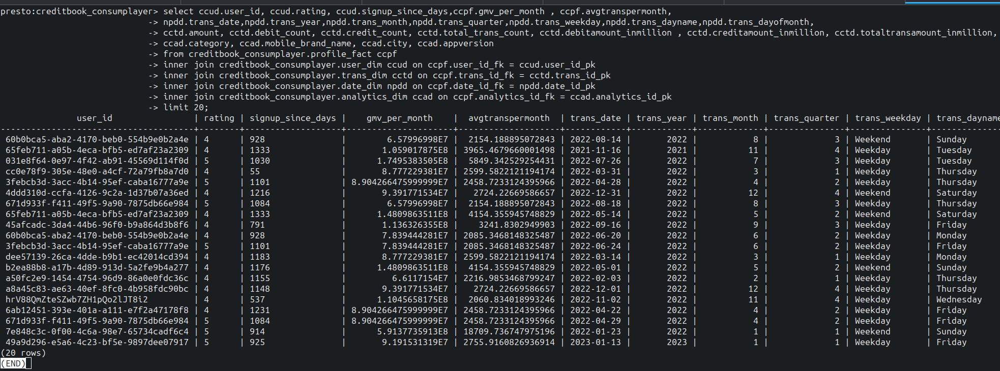
